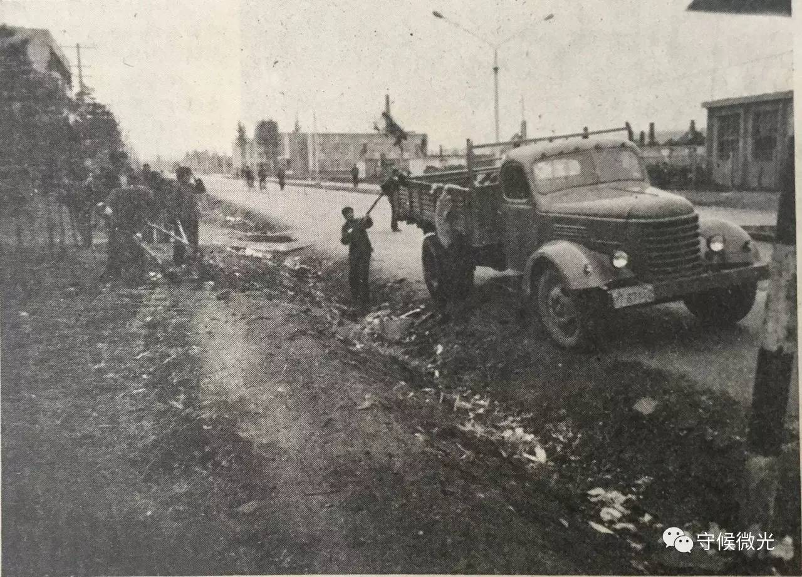
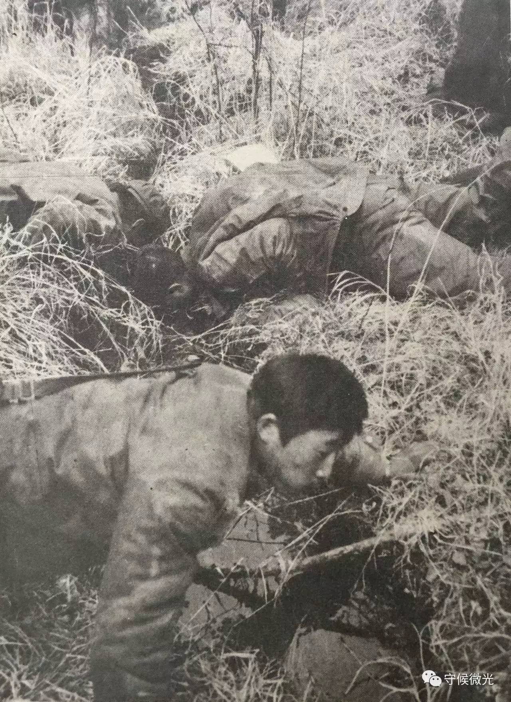
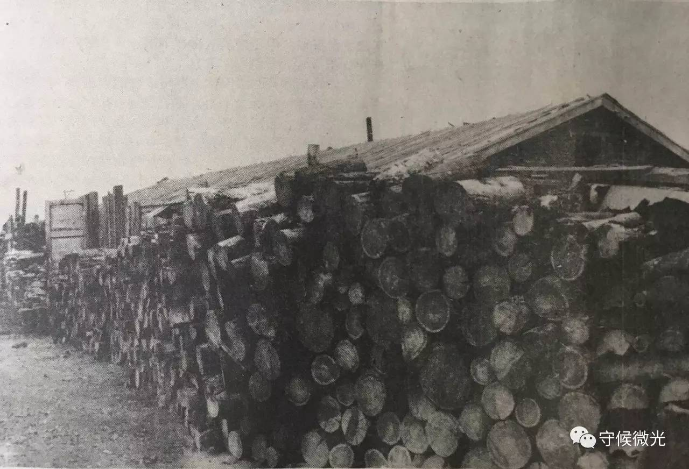
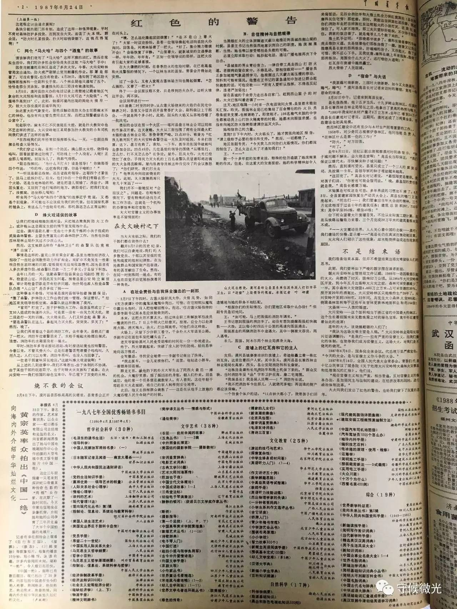
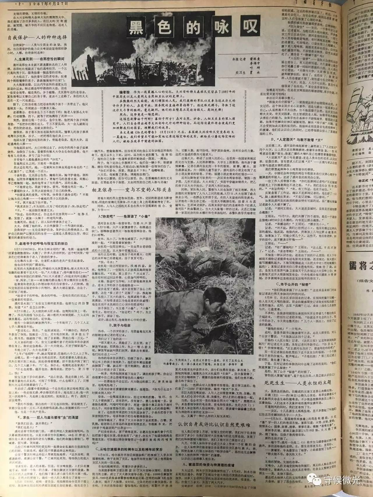
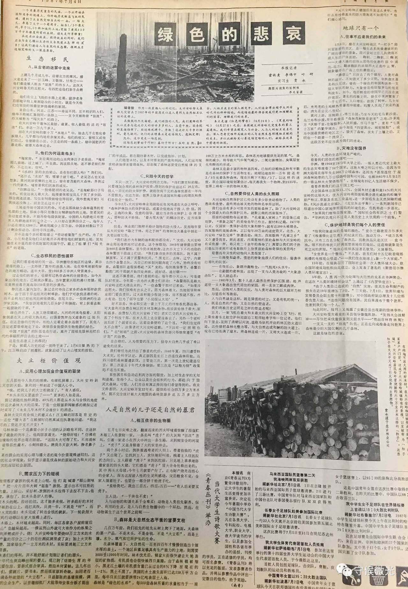

## 1987年大兴安岭火灾：红色的警告，黑色的咏叹，绿色的悲哀

原文刊于《中国青年报》，竹新社小编整理。

> 1987年5月6日，在大兴安岭地区人们的记忆中是炽热通红的。
>
> 一场特大森林火灾席卷了这片土地。这是一把“令5万同胞流离失所、193人葬身火海的火；一把烧过100万公顷土地，焚毁85万立方米存材的火；一把令5万余军民围剿25个昼夜的火”。这把火炎炎烧了近一个月。
>
> 1987年，大兴安岭北麓林区发生的“5.6”特大森林火灾是新中国成立以来，毁林面积最大、伤亡人员最多、损失最惨重的森林大火。28个昼夜的燃烧，使漠河县、塔河县境内相继受灾。
>
> 大火吞没了大兴安岭五分之一的林地，火灾过火面积124万公顷，其中有林地面积104万公顷。其中烧毁了漠河县境内的西林吉、图强、阿木尔3个林业局，烧毁活立木蓄积高达3780万立方米。大火造成了数百人伤亡，直接和间接经济损失约10亿元。
>
> 火灾令全国揪心之时，火灾发生的原因、过程也令人生疑。中国青年报记者叶研、雷收麦、李伟中以及实习记者贾永在火灾发生后奔赴火场。
>
> 历时30多天的采访，他们换回了中国新闻史上的一组经典篇章。从1987年6月24日至7月4日，三篇整版调查性报道《红色的警告》、《黑色的咏叹》和《绿色的悲哀》刊登在《中国青年报》醒目的位置。[1]

## 红色的警告

> 编者按：（未找到）
>

一把火，一把令5万同胞流离失所、193人葬身火海的火；一把烧过100万公顷土地，焚毁85万立方米存材的火；一把令5万余军民围剿25个昼夜的火，究竟是从哪里、为什么、又怎样燃烧起来的？

“这是天火”。——灾区一位老大娘说。

“这与‘厄尔尼诺’现象有关，北纬53°线左右有一道燃烧线”。——一位干部说。

“风再大也刮不出火来”。――大兴安岭林管局长说。

“五个火源都是林业职工违反制度和操作规程造成的。”——迄今一系列的报道这样告诉人们。

是的，现实给我们的答复往往不只一个。今天，大火熄灭了，然而，灾难留给人类的教训却是永恒的。

还是从几个小故事说起吧。

### 关于火种的故事

#### A. 加格达奇的故事

大兴安岭地区共有人口31万，是一个以木材和营林生产为主体的森工企业。首府加格达奇——美人松的意思，一个由少数民族语言赋予的美称。

虽说这里人口不稠，工厂不多，但街道整齐，交通方便，大都市里有的这里几乎一切都有。

许多奔扑火而来的记者都想不到有这么一个风姿绰约的森林城市坐落在深山老林里。

然而，他们茫然了。这里不叫镇，也不叫市，而被称作“加区”。“为什么不能称市？”一位政府官员告诉记者，大兴安岭是林业部的直属森工企业，地方行政归属黑龙江省，而版图又属内蒙古自治区。

一个媳妇仨婆婆。它不敢称“市”，一旦称“市”，行政归属问题就会扯皮，内蒙古自治区想收回它，黑龙江省又不肯轻易放掉这“碗边的肥肉”，更何况把它视为掌上明珠的林业部呢？于是，加格达奇只好委屈了。

大兴安岭成了真正的“一仆三主”。每年的企业盈利除上缴黑龙江地方财政几千万元外，还要上缴内蒙古自治区几百万元“土地使用费”，上缴林业部几百万元管理费。

1985年国务院规定，大兴安岭可从企业赢利留成中提留近5000万元育林基金。田纪云副总理曾指示，育林基金要“取之于林、用之于林”。就是这笔经费也要七扣八扣，林业部拿去相当大一部分移作他用。余下的除去上缴能源交通费，扣除维持营林机构经费等，用于森林保护的只剩下9%。而这部分又要分成林政管理、森林防火、病虫害防治、野生动物和自然保护区建设等若干项目。其中真正用到森林防火中的，已经所剩无几了。

道路，是林区的神经和血脉。有了道路，既能作为防火隔离带，又能为快速扑灭山火提供交通条件。世界上发达国家都十分重视森林道路的建设，这些国家每公顷林地拥有道路已达5-7.5公里，我国的伊春林区每公顷拥有道路2.2公里，而大兴安岭每公顷仅有道路1.1公里。修建道路的报告连年呈到林业部，林业部推到国家计委，计委又推回林业部；林业部的计划司推到森保司，森保司又推到计划司，人人都当“二传手”，谁也不肯掏包。

解决柈子城问题，既是节约木材、减少浪费的一个渠道，又是解决防火隐患的重要措施。以煤代木是一个高明的办法。煤，当地有，位于西林吉的古莲煤矿可提供大量生活用煤。但也苦于没有道路。“要修建道路，连通古莲。”大兴安岭林业局的领导早就下了这个决心，不可能向黑龙江和内蒙古伸手要钱，还要找林业部。可林业部迟迟不下达计划指标，你不给钱，我们自己解决，大兴安岭准备从已被拨去的护林防火基金中挤出钱来修路，林业部又以“无此文件”规定为名不许他们动用这笔钱。他们只好边斩边奏，修通了古莲至图强的一条沙石路。正是这条路竟成了一个屏障，在这次扑火中起了重要作用。可至今，这笔修路费用还在地方政的赤字栏上。

同样，森林瞭望塔是林区的眼睛。由于经费不足，大兴安岭的森林瞭望塔仅是伊春的1/3。缺少瞭望塔，无法判断火灾的方位。

“5·7”大火中，由于方位判断的失误，一度影响了正确的指挥。400名摩拳擦掌的森警指战员受命驰援，辗转奔波了4天，竟然没有找到可扑的火头。

真是“三个和尚没水喝”！这种弊端百出的体制结构、管理模式，不改革怎么得了！

#### B. 钱袋的故事

8年的经济体制改革成绩斐然，但旧体制的框架明显束缚着经济的更快腾飞。

由于大兴安岭的体制缺陷所决定，防火工作先天不足。防火指挥部归属地方政府，森警属于武装森林警察部队，空降灭火队则属东北航空护林局。

又是一个三足鼎立！

三家各有各的经济利益，很难形成一个协调的战斗的整体。

随着对外开放的扩大，1985年起，大兴安岭建立了护林防火中心，这里也组织了多人去国外培训。主管防火的大兴安岭地区行署副专员张凤鸣说：“我们设想建立一个统一组织、统一调动、统一指挥、装备现代化、战斗力强的扑火队伍和资源管理中心，可林业部迟迟不表态，直到今年的5月5日，发生森林大火前夕，还在为奖金扯皮。”

漠河县是我国最北部的一个县份，经济效益相当可观。地方上仓廪充实，县上花钱手脚也大，办公大楼、各项公益设施建造得都很漂亮。可是在防火投资上，他们却抠得令人瞠目。

按理，作为西林吉林业局所在地的漠河县应该建一座气象站，哪怕建一个气象哨也好，可他们舍不得花这个钱，也没人操这份心。

记者向县里一位副书记提出这个问题，他吞吞吐吐地说：“‘北极村’里有”。

距县城80公里的北极村，确有一座气象站，归属国家气象总局，负责全球气象资料的交换工作。站长周汝锵告诉记者，他们没有为漠河县提供气象预报的责任与任务，再说距离80公里，小气候也会有差异。话虽这么说，但这个站每年防火防汛期都主动向县里提供天气情况。谁能想到，漠河县这个“受益单位”却死活不肯掏这几百元的长途电话费。周站长苦笑着：“前些天还与县里一位负责同志为这事扯皮呢。”

扑火过程中，天上是飞机，地上是装甲车，实施人工降雨，开辟生土隔离带……有人计算，这次大规模、大兵团、立体化的扑火救灾，光是军需保障、后勤供给每天就要花掉近百万元。

这笔帐应该由谁来算呢？

条块分割的部门所有制，造成了这样一种怪异现象：平时不肯对森林防护多投资，而到发生火灾，却丢了大本钱。群众说：“防火时扎紧钱袋，扑火时却钱袋朝下，这钱花得冤啊！”

#### C. 两个“马大哈”与四个“酒鬼”的故事

请谅解我们使用了“马大哈”这样不雅的词汇。然而在现实生活中，我们的许多机会恰恰丧失在这批“马大哈”手中！

因使用割灌机在林区造成了多次火灾。今春，大兴安岭林管局发出通知，防火戒严期禁止使用割灌机作业。部署是部署了，可没有督促，也没有检查。4月28日，通知到了地区防火指挥部指挥科一位副科长手里，八个林业局他只通知了五个，恰恰是那生灵涂炭、惨遭损失的北三局没有被通知到。

5月5日，漠河县防火办的电话记录上清楚地记载着地区气象台的大风预报和高温警报： 5月7日大风可达“火险级”，气温将升高到23℃。此刻，距漠河境内出现的两处火情早一天；距大火吞没漠河县城早两天！

如此重大的气象变化，居然没触动县防火办主任那麻木不仁的神经。他没有向主管负责同志汇报，而把这预警截留在办公室中了。

玩忽职守，麻木不仁不仅表现在火灾前，就是扑火救灾中也不乏这样的例证。大兴安岭地区某局参加扑火救灾的小车司机向我们讲述了这样的故事。

“在西线我们的车经常拉指挥部头头。一天，一位副总指挥去检查火场情况。

“我们穿过火海，来到一个防区，满山那大火呀，烧得呜呜叫，眼看就要烧过防线了，可防线上一个人没有。人呢？正坐那儿喝酒呢。别说了头儿了，我都气得慌。

“副总指挥问：‘为什么不打火？谁是领导？’你猜那哥四个咋说：‘咋的呀，这疙瘩我们管，你是干啥的？’

“一听说是副总指挥，还是省政府领导，这哥四个才紧张了，说马上组织扑打。后来，他们中的一个给我们带路去另一个火场。还是当地林场的呢，硬是把道儿领错了。没法子，调回头重走，又回到了他们喝酒的地方。瞧那哥仨，把我们支走了，没挪窝，还坐那儿喝呢！”

听来两个“马大哈”和四个“酒鬼”的故事近乎荒诞，又都是个别现象，不可能也不应该成为我们的代表。但在国家机器的链条上，有这么几个齿轮有毛病，那机器还怎么正常运转！

#### D. 烽火戏诸候的故事

让我们把视线缩微到漠河县，把视点聚集到防火工作上，或许能从这悲剧发生前的情节里发现些什么。

过去，漠河县驻扎着一支由七十多名干练的小伙子组成的武装森林警察，主要负责富克山的森林防护工作，当然也协助西林吉林业局扑灭过不少次山火。

然而，这支被群众称作“森林卫士”的森警队伍竟被“请”出境了。

事情是这样的。富克山里有黄金矿藏，县里为增加经济收入招收了一些社会闲散劳动力开矿淘金。采矿中不免发生一些影响自然生态环境的问题，要根据有关法规收取费用。因为县里有人多次弄虚作假，被森警队罚款一万二千多元，于是留下积怨。

去年11月的一天，值勤森警拦住县黄金公司副经理的小车，检查进山证，并因此发生纠葛。接着县里公安局立案侦查，审计局检查罚款是否有经济问题，物价局也派人检查森警队办理“入山证”是否多收了钱……

这种事本不奇怪，可结果是漠河县领导拍着胸脯保证：“撤了森警，护林防火工作由我们统一管理，保证管好。”经地区有关领导拍板定案，森警队就这样撤离了漠河。

“官司”打完了。至于护林防火工作，县里虽然成立了一支30人组成的快速扑火队，可是第一没有一台风力灭火机，第二没进行一天的训练。大火烧来后，人们又怀念起森警来：“要是森警队在这儿，拿起风力灭火机，突突突，早灭了！”然而，晚了。

让我们再看看这个县的消防工作。去年春天，县糕点厂着了一把火，消防车拉着警笛来了，水枪手端起水枪摆出架式，谁想，消防车的水箱里没有一滴水。

平时，消防车多用来接站送站，有时接送站竟也拉响警笛。今春以来，不管风势大小，总是拉着警笛兜着圈子呜呜叫。久而久之，人们习以为常，消防车再叫，也没人当回事了。

一位老干部意味深长地说：“这就叫烽火戏诸候啊！”

从上述的几则故事中，我们不难看出，由于体制的不协调，由于某些干部的玩忽职守，由于对特大火灾放松了戒备，大兴安岭——我们祖国的绿色宝库中，早已埋下了灾变的火种。

*山火还在燃烧，漠河县却让县里各单位派车派人打扫市容卫生，以“迎接”上级领导的视察*

### 烧不散的会议

5月6日下午，漠河县委那栋高高的灰楼里，县常委会正开在兴头上。

“咦，怎么远处腾起团团的雾？”“是不是山上着火了？”大家一时议论纷纷。县委一位领导操起电话向县防火办询问，回答是，河湾林场着了一把火。“好了，集中精力继续开会！”会场恢复了平静。“山里着火，就像城里的交通事故一样，年年防，年年有。”正如一位领导说的那样，这把火没有引起大家的足够重视。

在大火骤燃的时刻，在春季防火的危险时期，在已有高温和大风警报的情况下，一个以林为本的县里，常委会开得如此安然。

过了一会儿，又有人发现古莲林场方向也腾起烟雾。“怎么搞的，又着了一把火？”

终于——会议原议程不变，只是移到防火办开。边听火情边开会，两不误。

会议照样进行……

8月凌晨二时至四时许，从古莲火场烧来的火焰仍在民宅中肆虐之时，县里又分层次召开县常委扩大会、副科级以上干部会，一开就是两个多小时。此刻，回头的火焰又从容地吞噬了一批民宅。

类似的会议在另一个火区——塔河县盘古林业公司以同样的节奏召开着。这天夜晚，大火从三面包围了拥有全国最大贮木场的盘古林业公司，形势异常严峻。21点30分，被誉为“红孩儿敢死队”的大兴安岭森警空运一大队及时赶到，乡亲们欣喜：这下，盘古有救了。谁知，一下车，教导员张国华就被叫去参加会议。23点45分，几位县里的领导仍围绕“从哪里打、怎么打、打不灭怎么办”在争论。屋外，狂风大作，火光已经烧红了夜空，手持风力灭火机的上百名森警队员望着即将进镇的大火急得直跺脚。屋内张教导员被这种没完没了的会议激怒了：“你们研究，我们打火去了！”他率兵冲向迎面烧来的大火，此刻，大火离弹药库只有几十米远了……

我们并不一般地反地“会而议之”。问题是，在特殊的情况下，要有特殊的动员方式和工作方法，这就是一个机构的办事效率和应变能力。

大火对官僚主义的办事效率是不留情面的！

### 在大火映衬之下

当大火来临之际，我们的干部们都在做些什么？

翻开5月7日的历史纪录，我们可以自豪地说，我们的大多数党员、干部以其坚强的党性和高度组织纪律性，在为抢救群众和国家财产而奋战，有的甚至献出了生命。然而，在同一时刻和同一地点，有的人也在自觉不自觉地扮演着另一种角色。

#### A. 在社会责任与自我保全撞击的一刹那

5月7日下午四时，古莲火场狂风大作，火借风势，如同《天方夜谭》中的魔鬼从魔瓶中爬出，可惜，在它刚刚从魔瓶中露出头角时，没人把他堵回瓶中。而这，任古莲火场指挥的县委李副书记原本是应该能做到的。

本来，这把火并不算太大，经过林业职工和解决军指战员一整夜的扑打，7日上午明火已经熄灭。按理，应全力以赴清理火场，消灭残火、余火，打出隔离带。可他们没这样做。

火场上，只留下少许职工看守，千余扑火大军退至公路。李副书记在面包车里吃罐头去了。

老天爷留给漠河人民免受劫难的时间在一分一秒的逝去。

终于，烈火窜跳起来，突破了没人防守的防线，轻而易举地向远方推进。

全军撤退，寻找安全地带——李副书记做出了抉择。

“我去派车，一会儿来接你们。”说罢，他钻进小轿车，一溜烟奔回县城。

群龙无首，被他扔下的扑火大军失去了同烈火最后一搏的机会。火魔狞笑着，摇了摇凶恶的身躯，朝人们扑来。回县城后，他的第一任务便是疏散家人。有人看到，这位年轻干部赶在大火进城前，将自己的家人转移到安全地带。

此后，他又去指挥群众疏散了——这是在从他手上放跑的火魔吞噬人民生命财产的时候。

#### B. 自信精神与自然规律

当黑烟红火的立体屏障遮天蔽日地推近到县城西侧山梁的时候，县委王书记当然强烈地意识到自己的职责。她泼辣果断，当然，她也难以接受哪怕是失败的可能。

必须立即采取行动！她抄起电话，通过广播电视再次下令出击。

“县城里的男女青壮劳力，一律自带工具去西山打防火道。老弱病幼留在家中，不得乱动。要相信政府……”播音员正参加地理气象函授学习，他根据这几天蒙古高压槽的移动，预料到可能有强风。他想在王书记的紧急通知中加进让群众赶快疏散的话，可他没敢——“所有人要听从指挥，不得违反纪律，违者严加惩处！”

留在县城的千余劳力走出各自家门，赶到西山梁子的时候，大火已经叫着进镇了……

这天，地区每隔一小时来一次电话询问火情，县里都未能如实汇报，昨天，图强林业局已经集结了百余精壮的扑火队员准备前来支援，也被谢绝了。即使刚才，106名稚气未脱的中学生都被动员上山打防火隔离带的时候，她都未向图强求援，也没有向地区防火指挥部请调空运灭火队。

她相信自己的力量。

直到7日下午六时，大火临头了，她才慌张向地区报告：“请上级给予必要的指示和支持。”然而，一切都晚了。

地区张副专员：“今天我几次问你们火场情况，你们都说控制住了。怎么火这么大了才通知我们？”

王：“……”

就一个十多年前的知青来说，特殊的经历造就了她泼辣果断的作风，但是，在这重大的灾害面前，她的科学精神却令人遗憾地与她的职务不相匹配。

“根据你们的实际情况，你们要地区采取什么办法？”张副专员急切地问。

王：“如可能，马上把图强的消防车调来。”

王书记想到图强的消防车了，却没有想到提醒图强赶快疏散——火浪，正以每小时四五十公里的高速向图强涌去。

图强派去的两辆消防车中途遇火，其中一辆被火吞没，两人遇难。

未几，图强、阿木尔两个林业局葬身火海。

#### C. 废墟上的红瓦房和它的主人

灾后，漠河县城凄凄凉凉的废墟上，奇迹般矗立着一栋红砖瓦房。这里住着四户人家，其中东头，漠河县县长兼西林吉林业局局长高家；西头：县公安局消防科科长秦家。

“这栋房是秦科长用消防车和推土机保下来的。”群众反映，当时消防车呈“品”字形卫护在高、秦二宅周围。

“我保县长？我是保人民啊——！”消防科长说。

“我不把消防科长卡住那儿，人就烧死多啦！再说谁的财产都应该保嘛。”

一个饮食个体户的话：“11点钟火都小了，我带孩子们回来保饭店，见四台消防车和大推土机全力保红旗旅社（县长和秦科长住宅旁）那疙瘩。那时，我前边吉祥旅社还没着，我说你们消防车去把吉祥旅社东边刚起火的小房打灭，这旅社就保住了。可人家不理我，那工夫只要好好组织，不少房子能保住。我家的饭店着了，就是俺爷儿几个救下来的。”

推土机手证明：“那晚都半夜多了，秦科长骑着摩托车喊我去推防火道。先是绕着他们那栋房推了一圈，接着又让我去推靠高县长家的那两栋房。好端端的房子，又没起火，推了多可惜，我不忍心下手。见我犹豫，秦科长就上车来指挥，推倒了那两栋房。周围没什么大火了，还打啥防火道啊！”

红瓦房在废墟中巍然矗立。

烈火借给了人民眼睛。

#### D. “宿命”与大话

“我原籍河南新野。三国时火烧新野，如今又火烧漠河。晦气，晦气！”漠河县高县长对记者来访时的寒暄，竟有一种宿命的味道。

5月31日中午，记者来到高县长家。

县长很热情，他十五岁当兵，十九岁转业到林区。任漠河县县长兼西林吉林业局局长之后，他拿出了更高的热情与魄力。

“1983年我来时木材产量才9万立方米，去年已增加到24万！”高县长自豪地对记者说。这期间，漠河还成了万两黄金县，市政建设也初具规模。

然而林区建设中还有至少与木材生产同等重要的工作。

1958年，刘少奇同志视察伊春林区。他问当地负责人：“在林区什么是第一位的工作？”

“防火。”对方回答。

“对了。”

去年9月11日，田纪云副总理视察漠河时明确指示：“柈子城问题不解决，会火烧连营啊！”高县长当即保证：“我们保证以煤代木，尽快解决柈子城问题！”

然而，直到漠河受灾，县里只成立了一个三人的煤炭公司，共拉煤一卡车。县领导家的柈子堆却越来越高。

“这回完了。”高县长对记者说，“最低限度是撤职。我对孩子们说，‘你爸爸可能会服刑去。’唉，最基层的责任者就是我。”高县长感慨万端。

不知算是可叹还是可悲，多年养成的习惯改不掉了，6月2日，全县重建家园恢复生产动员大会上，高县长的嗓门又洪亮起来：“同志们——！我们要拿出当年大会战的精神，三个月完成相当于过去十年的建筑任务！建筑总面积207,732平米！其中平房364栋，楼房40栋！”

台下听众望着大片废墟苦笑。不论从实际施工期计算，还是从铁路运输能力来看，三个月完成20万平米的建筑量根本完不成。

“……火灾震动世界，人人关心着中国的北极——漠河！我们建设的快慢，显示着……”高县长仍在真诚而激动地说着。

大火向人们昭示了这些现象，却未能烧掉造成这些现象的原因。

### 不是结束语

我们准备结束本篇，但并不希望结束这场灾难留给人们的思考。

此刻，我们要将如下严峻的数字摆在记者面前：

据大兴安岭林业管理局文件记载，1966年一场因吸烟引起的大火，共燃烧了32天，毁林52万公顷。从1964年大兴安岭林区开发，到今年五月这场特大火灾之前，森林可采资源减少了一半。其中森林火灾烧毁4,865万立方米，占可采资源的30%。按开发20年的消耗比，大兴安岭林区只能维持生产26年了。大兴安岭开发到1986年，22年间，共发生大小森林火灾881起，烧毁森林面积等于这些年来营林更新地面积总和的164倍！

大森林——人类的摇篮。

大兴安岭——这个面积相当于浙江省的中国最大的林区，这个生长着祖国未来无数栋梁之材的绿色宝库，竟年年在遭受着如此的戕害！

连年的大火，该烧醒酣睡的人们了！

“我认为这场灾难主要是人祸。”大兴安岭林业局局长邱兴亚语调颤抖：“是我们——犯有严重的官僚主义，而我们僵化的体制，也使得我们成为官僚主义。这场大火，对我们是不烧死的烧死。”

1987年6月6日，国务院全体会议。代总理万里严肃宣告：“今天的大会，是与官僚主义作斗争的大会。”

1987年6月18日，全国人民代表大会常委会。常委们代表十亿公民审议了国务院《关于处理大兴安岭特大森林火灾事故和处理情况的汇报》。他们说：

“现在官僚主义相当严重，相当普遍。反对官僚主义的根本办法，是加强民主与法制的建设，在经济改革的同时，进行政治体制改革。”

大火向我们发出了红色的警告，也给我们留下了沉重的思考。

## 黑色的咏叹

> 编者按：作为一段震撼人心的记忆，大兴安岭特大森林火灾留在了1987年的中国历史以及人类同大自然相互认识的史册上。
>
> 在熊熊的烈火面前，我们顽强的人民，我们英雄的军队以及参与这次扑火的许许多多的人，在党中央、国务院的直接部署指挥下，经过殊死搏斗，夺取了这次扑火斗争的胜利。毫无疑问，他们的业绩真正是赴汤蹈火、彪炳史册！
>
> 然而，这毕竟是一场悲剧。
>
> 这场悲剧肇始于何时？蕃衍于何方？在对自然、社会、人相互关系的深入探究中，人们自会得出超乎大兴安岭之外的种种结论。而这结论最终会使我们更加理解我们的国家，理解我们的改革。
>
> 本文是继《红色的警告》之后，本报就大兴安岭火灾发表的又一篇通讯。我们希望尽可能如实地记录这场灾难的史实，献给关心这场灾难的人们，献给在改革中前进的祖国。
>

无情的焚烧，无情的冶炼。

在大兴安岭特大森林火灾的熊熊烈火中，我们看到了许许多多的人。在巨大的灾难面前，被焚烧、被升华的不仅是物质，还有人的灵魂。

### 自我保护——人的种种选择

自我保护——人类与生俱来的欲望。然而，当自我保护的能力在灾难面前显得那样渺小时，人呐，你将做何选择？

#### A. 生离死别——在那悲怆的瞬间

漠河县那位本来就不愿透露姓名的工人师傅，吞吞吐吐地叙述了他的逃难经历，一个五尺高的汉子，眼角挂着一颗晶莹的泪珠。

大火临近了，他扶着年迈的母亲，扯着两个刚刚懂事的孩子，跌跌撞撞地冲出了家门。

大火拖着浓烟，以比汽车还快的速度从后面追扑过来。附近都是呼呼燃烧的火苗，没有一处安全地带。越是焦灼，步子越慢，尤其那年迈的老母亲，紧张得难以支撑身子骨，更谈不上走路了。身后的大火还在一丈一尺地逼近。

眼下，已经没有能力把母亲和两个孩子一齐带走了。他只能顾及一头，否则就会一同葬身火海。

进退维谷，老母亲是万万不能扔下的！她老人家那么大年龄，行动缓慢，扔了，就等于把她掷给了死神……

突然，眼前出现一个沙丘，急中生智，他两个孩子叫到身前：“爸把你们埋在这里，千万不要乱动，火一会儿就能过去，把你奶奶送走，爸就来接你们。”

烟很浓，孩子看不到爸爸眼角的泪花。懂事的孩子乖乖地趴到沙坑里，沙子，一把把地埋在他们身上……

他回头望了望沙坑里的孩子，背起母亲，甩开大步，追赶逃难的人群……

当他返回时，火已经烧过去了，沙坑中的两个孩子虽被烧伤，却保住了性命。看着那些被大火夺去生命的遗骨，他不免有几分庆幸，多亏了这个沙坑！

并非每个人都能遇到这样的“沙坑”。

在她和丈夫之间，只能有一种选择！

烈火近在咫尺。她，一位被阿木尔林业局连年命名的“三八红旗手”，已哭成一个泪人。

十余年前，丈夫因公负伤，瘫痪在床。她守护着他，照料着他，如同侍弄襁褓里的孩子。青梅竹马的恩爱夫妻，两颗心早已熔铸到一起。她给他带来了生的勇气，活的乐趣。

“不能背你走，我就守着你。要死，咱俩也死在一块。”一个孱弱的女人，在烈火面前做出了自己的抉择。

“你要是真的爱我，可怜我，快带孩子逃命去吧！”不能让她为自己殉葬——一个瘫痪的男子汉的抉择。

“不。我不能丢下你不管。”

“我求求你了，不为别的，只为了咱们的孩子，快，快走吧！”

“不。”一双泪眼注视着丈夫。

“快走，你给我快走，你这是在坑害我呀……”他挣扎着，发怒了，就像一头狮子一样地吼叫着。

生离死别：她走了，泪人似地带着孩子走了。

大火，吞噬了她的家。大自然撕毁了一个和谐的家庭。

自我保护——无论是保护自身，保护自己的骨肉亲人，保护自己的财产以便灾后生存——这便是人类得以生存，得以繁衍的最原始的动力。

#### B. 赵老爷子的呼唤与张宝玉的剖白

5月7日23时30分，阿木尔林业局的广播、电视一遍遍地播送紧急疏散通知。太晚了，许多人并没听到，这个时间里，母亲们已经搂着孩子进入了甜甜的梦乡。

五处靠西头第一家，住着贮木场的老共产党员赵喜荣。

他也没有听到广播通知。

红彤的火光映着夜空，呼啸的大风挟雷携电。被火光和大风惊醒的赵喜荣不觉大吃一惊：“大火烧来了，得叫醒邻居们……”

他敲响邻居们的窗棂：“快，大火进镇了，快起来向河边跑！”

一家、两家、三家……被惊醒的群众拖儿带女撤向安全地带。

赵喜荣和老伴及小外甥却惨死在自家窖中，人们猜测，他叫完邻居回去领老伴和小外甥时，被大火堵在屋里，没法子，只好钻了地窖。

“赵老爷子的呼唤，救命的呼唤，一直响在我们的耳边。”一位被救的邻居说。

漠河县木旋厂厂长张宝玉模样挺英俊，他曾经当过消防警察，知道“火”是怎么回事。

5月7日晚上，大火烧到桥头贮木场，他爬到房顶上一看，糟了，西北风刮得飞沙走石，碗口粗的大树被刮断，火头正向镇里蔓延。还有啥说的，赶快跑。

他有一台破旧的解放牌汽车，一个车轮坏了，几个工人七手八脚地装车轮。

“要说私心，我有。”他坦诚地说：“不瞒你们，我的汽车参加了保险，险额是一万五，其实现在转卖，顶多值五千元。我寻思，烧就烧了呗，烧了去索赔，我能白得一万元。”

大火来临的前一天，张宝玉就嘱咐妻子把保险单和存款折带在身上，做好应急准备，万一大火烧来，不至于倾家荡产。

车轮上好了，大火也进镇了。

“上车！”他招呼一声，跳进驾驶室，在场的八个工人上了车。

去哪儿，第一个意念当然是回家，先把老婆孩儿接出来。汽车灯照不到三米远，到处弥漫着烟雾，好不容易冲到了家门口，几个工人跳下车：“厂长，装什么，电视机还是家具？”

“什么也甭管，砸开仓库，搬两袋面，把炒勺、菜刀带上，快！”

张宝玉放下手中的茶杯：“说心里话，我走在路上时，还想着尽量抢出点东西，可到了节骨眼，什么也顾不上了，只想到大火过后别饿着就行了。”

车启动了，烟雾中看到路边一个走失的女孩正哇哇哭泣，他拉上来；一些走投无路、牵衣顿足的老乡，他也拉上来。他一次又一次地停车，凡是路上他见到的，统统拉上，终于，逃到了安全地带。

“我的车没烧，那白捡的一万元也没捡到，家是烧光了，家底少说也有一万五。不是扬脖唱高调，我心里挺踏实的……”

他，也是一个共产党员。

#### C. 求生——犯人与庭长都有“生”的渴望

“放我们出去，放开我们！”

“我们也是人！”

漠河县看守所的铁门里，一群在押犯人发疯似地吼叫。当天幕被烧成暗红色，火星火球在空中乱舞时，48名在押犯人顿失往日真实或伪装的老实与慎微。他们死命撞击着铁门，呼喊着，狂叫着，哭闹着。

几位已经判死刑的要犯和一起黄金走私案的主犯深知自己的归宿，但就是死，他们也不愿意选择这种死法。

公安干警及时将这些犯人带离危险地带。“这次没死，我感谢政府，感谢公安干警。”已被判处死刑、等待执行的犯人刘兴河说。

寻求生存，是人的本能。但是，在灾难面前，人们只有携起手来，结成一个统一的力量，才能抗御更大灾害的侵袭。数以万计的人这样做了，他们抛下妻儿老小战斗在扑火第一线。但是，在烈火的焚烧下，确有一些人的人格发生了衰变——

5月21日21时，前线一度告急，局指挥部命令党员干部上前线，图强林业局法院经济庭张副庭长却犹豫着，他先是登上了一辆汽车，想偷偷溜掉。但没有泯灭的良心又告诉他这样做的卑下，他又从车上下来。这时，远方的火龙在腾飞，他害怕了，他怕自己也像一些遇难者那样被烧成一段炭、一滩油。

终于，他下定决心非溜掉不可。他拦住一辆小车，软硬兼施，缠住司机要拉他走。车刚启动，被指挥部一位领导拦住了。

“你们不要命，我要，我就是不下车！”他嘟哝着。

八天后，他被撤了职务，调离政法部门。

职务可以撤销，处分可以接受，你，在那瘫痪在床的丈夫面前，在赵老爷子面前，又如何找回自己的人格与灵魂？

*水，可找到水了。在烈火中穿行一昼夜，扑灭了五处山火的森警战士，在一条小溪边趴下就喝*

### 相互依存——变与不变的人际关系

席卷大地的烈火使物体扭曲、变形，完好的街道成为断壁残垣，明亮的玻璃化为液体，扑火战士身上的笔都被烤变了形。

同样，人与人之间的关系也在烈火中呈现新的组合、变异、升华……

#### A. “你走吧”——他原谅了“小偷”

漠河县东北角一栋宿舍里，住着六户居民。5月7日晚，六户人家携妻带子，相继逃出家门。眼睁睁望着烈火一栋栋地吞噬掉房舍，他们心疼啊。

夜半，风小了，火势也减弱了，六户居民凑到一起：“不能看着家被烧！”

农机局一位同志牵头，一支由男女老幼组成的小小队伍，在火海中穿越而过。

来的正是时候，这栋房子尚未着火，但附近的木拌垛已经着起来，房子岌岌可危。

“快，寻水！”

农机局一同志冲回自己家中，找桶找盆。忽然，他愣住了：一位陌生人正趁混乱跑到他家里翻东西。“可恶，梁上君子！”火过来了，他没有时间过问这件事，心里却气呼呼的。

水桶、脸盆叮当作响，人们穿梭般奔来奔去，连未上学的孩子也端起了脸盆……

或许是受了感染，或许是受到了良心上的谴责，这位“梁上君子”迟疑了一会，挽起袖子，也投入了灭火的战斗。他真诚地干着，汗流满面，不知情者还以为他是谁家的亲戚哩！他是在用汗水洗刷自己心灵中的罪恶吗？

房子保住了。失主看“小偷”，“小偷”看失主。相对无言。“你走吧！”终于，失主挥了挥手，原谅了他。

或许，通过洗礼，“梁上君子”能弥补心中的空虚。

#### B. 孩子与母亲

伟伟，一个四岁的孩子，用那童稚而又天真的眼睛望着记者的笔记本。

我们记下了他的话——

“那天着了大火，我跑丢了，正在哭，来了解放军叔叔，把我抱上车，车上一帮小朋友呢。解放军叔叔叫我们别哭，都趴在车厢里，他们站在边上……”

伟伟的母亲告诉我们，怕烧了孩子，解放军让车上的孩子统统趴下，他们在车厢边挺着肩膀围成一圈，就这样一直开到满归，最后又千方百计把孩子送了回来。

一转身，伟伟钻到床底下玩去了。调皮的孩子啊，你会记得烟雾中自己身边那堵草绿色的人墙吗？

——但愿他也不会忘记。大火烧过的第二天，育英林场里，他呱呱坠地了。

父亲刘存章在废墟前踱来踱去，他埋怨：“你为什么这个时候来到人间？”

母亲，一位鄂温克族妇女，经过灾难的折腾、惊吓，生下儿子便病倒了。没有奶吃，没有屋子，婴儿也奄奄一息。望着脸色蜡黄，气喘吁吁的妻子，再望一眼那个真正是生不逢时的儿子，刘存章愁肠百结。这时，他多么需要人们的帮助啊！

来了。边防驻军某团卫生队巡诊来了。子弟兵把母子双双接到医疗队，母亲和孩子的生命都得到保全。

团领导跑来了，带来了大火中幸存下来的乳粉、白糖、麦乳精。距团部几百里远的某连听到消息后，专程派车来，把100多个鸡蛋送到产妇身边……

产妇没有奶水，孩子饿得直哭。志愿兵包双喜的妻子代花拉把孩子揽在怀里。母亲流泪了：“孩子，你长大了知道你妈妈是鄂温克族，可你能记得你曾经接受过一位蒙古族妈妈的哺育吗？”

#### C. 从哈尔滨摇来的轮椅车以及轮椅车的背后

5月31日，哈尔滨市平房区保国涂料厂的残疾工人李永祥摇着轮椅，终于来到了灾区。他亲手向有关部门送上他捐助给灾区人民的一百元钱。

在他的轮椅背后，有着许许多多的人。

当美国泰勒斯卫星显示大兴安岭火情时，是国务院当机立断，成立灭火救灾领导小组。于是35000名解放军官兵、7000名武装森林警察相继奔赴火场，空军的68架飞机也投入救灾，揭开了大规模、长时间、立体化扑火救灾战役。在东线，子弟兵连续奋战，誓保塔河；在西线，军警并肩战斗，切断火源，扼守防线，保护原始森林。没有社会的力量，这把火造成的损失可能更大。

这场大火，牵动了全国人民的心，也受到一些国家和地区的关注与支援。人民捐款捐物，大学生上街募捐；海外游子慷慨解囊。记者在漠河县见到一车车的服装、被褥、罐头、面包源源运来。六一国际儿童节前夕，漠河县的小朋友收到了北京小朋友寄来的铅笔、手帕，福建小朋友寄来的红领巾……

还有比财物更可珍贵的——灾区里有两家邻居，曾因一些矛盾，几年不说话，大火来临了，邻居甲穿越浓烟烈火，把乙的孩子从大火中抢出，于是两人和好如初。

同样，军队和人民，警察与人民也加深了相互理解，烈火浓烟的灾害缩短了人与人之间的距离。5月7日，大火包围了盘古林业公司，一些群众无所措手足，有的人无望地向院里泼水，以求能有一块生存之地；一位老大爷跪倒在地，迎着火头直磕响头，乞求神灵保护。而真来保护他们的是被称作“红孩儿敢死队”的森警战士。当大火头像墙一样扑过来，火舌已经舔着一家居民房的松木栅栏和仓库油毡时，森警队教导员端着往复式水枪冲进烈火中，战士们也勇往直前，趴在地上，把脸贴在地上端着风力灭火机猛烈“扫射”。防火服冒烟了，防火安全帽烤软了，裸露的脸部被灼得冒油，他们全然不顾。盘古终于保住了。

过去，一些群众对人民警察有些看法，盘古保卫战后，他们杀了一口400斤重的肥猪，犒劳“敢死”队员。

在巨大的灾难面前，人与人之间需要理解、支持、信赖。烈火，使人们心灵中的真、善、美曝光，把人们的心熔铸在一起。

当然，也会有另一类的现象在烈火中“曝光”：熊熊烈火中，某县委领导家的电冰箱、彩电和收录机，先后六次被其爱人单位里的人抢运转移；还有，那废墟中赫赫矗立的县长与消防科长家的红瓦房……

这，又属于一种什么样的人际关系呢？

### 认识自身或许比认识自然更艰难

当人类已经登上月球、征服太空的时候，我们对于自身到底认识了多少？当我们面对大自然施与的这无情浩劫，发现了我们种种孱弱与颟顸时，我们又能对自己做些什么？

六月，中国人体科学学会成立大会上传来一个有趣的信息：一位人体特异功能者曾自告奋勇前往灾区参与救火。然而，即使是被人们视为神奇的“特异功能”，恐怕也无由解释灾难中人性的种种“特异”的暴露。

认识自己还得靠人类自身。

#### A. 被送回的物资与待清理的废墟

大火过后，阿木尔百货商场被哄抢了。5月8日，阿木尔林业局发出通令，拘留了无视法令趁火哄抢百货商店的案犯时，很快，30多人主动向公安机关送还哄抢的洗衣机、收录机、布匹，价值三万余元，共拉了两大汽车。

灾难面前，法律、纪律、公共道德在短时间内失去了它原有的权威，过去的秩序被打乱了。然而，人毕竟是社会的人，而社会秩序、规则迅速重新建立时，人们也恢复了心理的平衡。

物质的损失和废墟需要清理，但精神呢？

“四大皆空”——灾后，一个青年对记者说。记者看到，当附近烈火尚未熄灭，许多救灾工作正在进行时，漠河县招待所里，一些工作人员每顿都要喝酒，有时酒瓶里还剩一半便扔进篓里。吃饱喝足，口袋里揣上几瓶罐头，腋下夹几瓶啤酒，摇摇晃晃扬长而去。仅仅说他们暴殄天物，不珍惜救灾物资，似乎太表面化了。莫非是“一醉解千愁”吗？

“人生的一场梦”——县防火办旁的运动场主席台上，有人这样写道。大片废墟上孤苦伶仃地矗立着一间临时搭就的小房，主人老白对记者说：“火烧当时穷。火来得太突然，就和做梦似的，家没了，东西没了，像我这样，人没伤着就不错了，谁知道今后怎样啊！”

“火大、风急，人力不可抗拒。就是中央领导来了也没用。”某位县里领导说。

灾难是可怕的，但是在灾难面前的颓唐困顿、束手待毙，不是比受灾更可怕吗？

幸而这只是极少数人。

“图强灾后仍图强”，一家报纸这样介绍图强林业局。大灾过后，这个林业局并未心灰意冷，而是与群众一起重新认识自己。人虽然离不开大自然，但不能屈服于自然。这次发生的特大火灾，有天灾因素，但主要原因是人祸，如果早些冷静地认清自己的能力，如果早些在森林中开辟隔离带、修筑防火道路，如果早些解决好林区城镇规划，解决“柈子城”问题，是不会受到如此沉重的惩罚的。图强林业局党委首先清理精神上的废墟，他们在认识自己的同时，已经带领群众投入了重建家园的工作。

#### B. “人定胜天”与敢不敢看“天”

灾后第二天，漠河县的残垣断壁上赫然刷上了“人定胜天”四个大字。山上烈火还在熊熊燃烧，废墟里余烟袅袅，一些死难者还在暴尸街头，恢复广播的大喇叭里已经播放着豫剧唱段。

“人定胜天”的口号是愿望，更是人类永恒的追求。认识灾害，征服自然，首先要求人们正视“天”——正视与承认自然灾害与造成这些灾害的成因。

我们联想起种种令人啼笑皆非的事情。

一天，中国社会科学院的两位专程前来进行灾害心理学专题调查的年轻人，走进了漠河县民政局的办公室。

一位工作人员带搭不理：“你们是新闻记者吗？”不无疑惑的眼光上下扫视着两位不速之客。“不。我们是社会科学院的。”“有证件吗？”“有。有工作证，也有介绍信。”

反复查看了工作证，确认不是新闻记者后，他长舒了一口气，脸上渐渐堆出笑来：“不是记者嘛，可以接待。”

如果说漠河县民政局的做法情有可原的话，县广播站欺骗记者就令人大惑不解了。

记者：“请问王局长，大火逼近县城时，县里是否通知群众疏散？”

王局长：“5月7日，我们共播了四个通知，最后一个通知是傍晚18时30分左右播的，内容是让群众疏散。”

记者：“谁播送的？”王局长：“播音员小×。”

记者：“对不起。我们已经找过小×，他没有播过这样内容的通知。他还说，他很内疚，没敢加上几句让群众疏散的话，如果加上了，可能少死几个人。这些天，他在给老师、同学的信中，还不断表示忏悔……”

王局长：“……”

记者：“有广播稿吗？”王局长：“这么乱，早找不到了。”记者：“录音带呢？”王局长：“……”

不知是一种认识方法，还是由于别的什么原因：有人下令邮局不得给记者提供电话电报用来发稿，甚至规定，报火情只能写割灌机起火，不能写吸烟起火（五把火中有三把是吸烟引起的）。某报记者使用自己带来的电传机，竟被罚了款。而这，是发生在世界气象卫星每天十几次掠过大兴安岭上空；林业部每天召开火情新闻发布会；中央电视台每天播放火情新闻；许多新闻单位竞相设法发回稿件的情况下。

#### C. 终于公开的“秘密”

——“你们到底掌握了什么秘密？”这是某县某部门对本报记者进行两天单独讯问时的问话。

5月30日，在灾区采访回来的记者，在招待所餐厅目睹一些人大吃大喝的场面，职业的敏感驱使记者取来相机拍摄了这里的场面。此时，这里“高潮”已过，桌面上尚有几名食客与六、七盘菜肴。

不多时，县旅游局副局长兼招待所所长带着几个粗壮的汉子闯进来，一把扭住记者的衣领：“你就是李先念的儿子、邓小平的孙子，今天我也整死你！”几个人一拥而上，扭住了记者的胳膊。

“砸他的相机！”一片吼声。

此时，县委李副书记敞披着军大衣，站在人群背后，对几个公安干警说：“不能放过这四个记者。”

在场的《人民日报》记者，《农民日报》记者和新闻电影制片厂的记者无不义愤。某报记者问李副书记：“你怎么不管？”李悻悻地说：“反正漠河也没好了，愿意咋的咋的吧！”

另一名记者取出相机想拍下这不该发生的场面，一个干部伸出手来挡住镜头，粗声喝止：“不准拍照！”第三名记者上前劝阻，竟也遭了拳头。

于是，在对记者的单独讯问中出现了这样的发问：“你们到底掌握了什么秘密？”

是的，到了公开“秘密”的时候了。

害怕别人掌握“秘密”，羞于亮出自我，人类怎能认识自己！

### 死死生生——人类永恒的主题

火，虽然是炽热的，但酿成的灾害又是那么冷酷无情。

在满（归）——西（林吉）公路九公里处，草草安葬着五十多名被烈火夺去生命的罹难者。不少简易棺椁停放在山坡上，压着油毡，人们还来不及像样地祭奠和安葬死者。

在看到死的同时，我们更看到了生。

——灾区，十几名新生儿呱呱坠地，差不多都起了叫他们记住这历史瞬间的名字——火生。

——5月24日，图强物资库废墟的简易帐蓬前，大红“喜”字一扫人们的愁眉苦脸。喜联写道：火情、灾情、爱情，情情系心；国事、家事、婚事，事事在意。横额“患难夫妻”。

新郎李庆增、新娘王淑芬原订5月10日结婚。大火烧了洞房，烧了嫁妆，但烧不散两情依依。

新的生活开始了。

——端午节，漠河一中高二（1）班学生马媛春做好两个纸葫芦，亲自送给她的老师。生，要生活得更充实，更美好。

——废墟里，羊角葱冒出了绿芽，小姑娘看到了生机……

“野火烧不尽，春风吹又生。”

无情的焚烧，无情的冶炼。

灾难中，人的灵魂受到陶冶和锤打，真正的人格在烈火中得到新生。崭新的人与人的关系在缔结，社会主义精神文明在萌生——美，是烧不毁的。

愿这把火烧掉人们的无知与愚昧，烧掉人间的丑恶。

大森林，留下了黑色的咏叹。

## 绿色的悲哀

> 编者按：作为一段震撼人心的记忆，大兴安岭特大森林火灾留在了1987年的中国历史以及人类同大自然相互认识的史册上。
>
> 在熊熊的烈火面前，我们顽强的人民，我们英雄的军队以及参与这次扑火的许许多多的人，在党中央、国务院的直接部署指挥下，经过殊死搏斗，夺取了这次扑火斗争的胜利。毫无疑问，他们的业绩真正是赴汤蹈火、彪炳史册！
>
> 然而，这毕竟是一场悲剧。
>
> 这场悲剧肇始于何时？蕃衍于何方？在对自然、社会、人相互关系的深入探究中，人们自会得出超乎大兴安岭之外的种种结论。而这结论最终会使我们更加理解我们的国家，理解我们的改革。
>
> 本文是继《红色的警告》、《黑色的咏叹》之后，本报就大兴安岭火灾发表的第三篇通讯。我们希望在探究人与社会，人与人的相互关系之后，深入思考灾难所反映出的人与自然生态环境相互制约的关系，并以此献给关心这场灾难的人们，献给在改革中前进的祖国。
>

一个肩着历史重负的民族，一个正开始在国际竞争的跑道上，作跨越历史断层飞跃的民族，遭到了大自然灾难当头的一击。一场大火，席卷了大于一个葡萄牙、相当1/3个意大利，等于15.5个新加坡的土地；焚烧了建筑430万平方米楼厦所需的木材，损失是何等惨重！

在追求社会效益、经济效益的同时，我们应当与自己赖以生存的大自然建立怎样的关系？让我们透过人与自然的生态圈，探测五月这场灾难的又一深层原因。

### 生态移民

#### A. 从古老的迷雾中起来

上溯几个月或几年，迎着北方的寒风，播火者走来了——汪玉峰、王敬保、付邦兰……他们都是被人称为“盲流”的外乡人。这次大兴安岭春天的五把火，有四把是他们亲手点燃的。

他们在尘土飞扬的乡路上走着，跋涉者身后那地平线上渐渐隐没的小村庄，就是今天他们在牢房的铁窗里梦绕魂牵的家园。

来自山东、河北、江苏……命运不同，互不相识的人们，络绎不绝地汇集到同一条路上——一支今天被称作“盲流”，昨天被称作“闯关东”的路上。

在大兴安岭干着林区最脏、最累，收入最低的活的“盲流”们，多达一万九千多人。

而在大兴安岭的数十万“本地人”中，除去几千名鄂伦春族猎人，几乎都与内地有亲缘关系。他们的祖父、曾祖父或他们自己，也曾踏在小汪、小王走的同一条路上，朝中国肥沃的最北部，朝着大森林走去。

#### B. 他们为何远走他乡

“俺家穷。”来自黄河边的山东菏泽汉子老吴说，“俺家那几亩地，过上碱了，不长苗。再说那点地，还不够老娘们种的，不走出来，穷呵。”

“《水浒》里的水泊梁山，是在你们那儿吗？”我们问。

“还什么‘水泊’哩，哪辈子就干啦。”老吴怎么也无法想象，黄河两岸贫瘠的土地上，曾有着茂密的大森林，养育过一代豪杰，哺育着我们民族的成长。

“你瞧这信。”一脸络腮胡子的老吴说，“是俺家那口子写来的。听说这块儿着大火，她搂着我那宝贝儿子哭了多少回，得信我还活着，写信来叫我做啥也得回家。我咋想离开家？可我钱还没挣上，回去怎么过日子？”

土地是传统中国农民的命。可老吴那块缺少森林蕴养的有机质的土地，那块小得只用靠妇女精耕细作的土地，使老吴的劳动变成多余，不能再给他提供财富。中国的人均耕地只有世界人均耕地面积的三分之一，人口却占世界四分之一。每年人口还在增长1200万，耕地则减少上百万亩。中国农村数以千万计剩余劳动力，亟待寻找出路。

并不是每个农村都能建立“劳动密集型”生产的。为了生存，小汪和老吴他们只好离开不再带给他们财富的土地，犹如驰往未开垦西部寻找财富的美国牛仔，踏上了祖辈们“闯关东”的老路。

#### C. 生态移民的恶性循环

让我们看看地球的另一边，非洲撒哈拉地区的边缘，黄沙漫漫的路上，一支持续了数年的浩荡人流，也在艰难地朝有绿色的地方蠕动。连年的大旱，使1000多万非洲人背井离乡。

过去他们的家乡，也曾有过热带森林的壮丽景色，如今大象出没的地方，已被流沙覆盖。当年繁荣兴旺的港口市镇，现在竟然坐落在离海岸150英里的沙漠内。

移民进入塞内加尔，像过去对待自己家乡有森林那样砍伐树木，由于因干旱而枯死的树难砍，他们宁可砍伐活着的树，而不去利用已经枯死的树做烧柴。在尼日尔，一位欧洲的生态学家反映，“我惊讶地看到几百头驴子和骆驼，背上驮着连根一起拔出的干草。”

绿色消失了，人流又继续蠕动。大河的河床龟裂着，太阳像倒悬在天上的硕大热风机，扫荡着憔悴而又疲惫的迁徙队伍。在这悲惨的行列中，有的人走着走着永远倒下了，其他人注定还要艰难地走下去，继续吞食能提供生物能源的绿色。

中国“盲流”的队伍也在行进，离开了因祖先毁林而把后代的幸福抵押出去的土地……

这是生态意义上的移民！

于是，被载入历史的这一刻终于来了，5月6日燥热的下午，汪玉峰启动了割灌机，就像启动了让火山喷发的按纽。

*在内地可派大用的好木材，在大兴安岭林区被劈成烧柴柈子，堆在家家户户门前。这成了大兴安岭城镇特有的景观，以至称为“柈子城”。大兴安岭居民每年要烧掉约六十万立方米这样的“柈子”。这些柈子在火灾中成了引火烧身的主要燃物*

### 大立柜价值观

#### A. 实用心理加现金价值观的驱使

五月那令人焦灼的傍晚，电视机屏幕上，大兴安岭跃上天空的火焰，像利剑一样剌进了中国人心中。

“唉，把我儿子的大立柜烧没了。”有人感叹。

“木头东西又要涨价了……”更多的人如是说。

据记者随机抽样调查，80%的人都是从木头与金钱的角度评价这次森林大火的后果。于是一位颇富新闻敏感的晚报记者及时采写了《未来几年木材不会涨价》的消息。

森林火灾只有金钱上的意义么？汪玉峰的回答是肯定的——这位“播火者”在被捕时仍然真诚而执著地问道：“我这个月的工资还开支不开支？”

马林林场一个高鼻梁小伙子小胡的认识略有不同，在送怀孕的妻子疏散的列车上，他两眼放着光：“烧得好哇！”仿佛有个仙境般的世界出现在他的眼前。“这回大火可帮了忙，不用清林了，省得那些灌木、小树绊跟头，瞧我冬天砍大树，挣老鼻子钱！”

某些群众的实用心理与播火者的现今价值观殊途同归，这有趣的社会学现象，似乎显示着乱伐森林的原始动力和大兴安岭之灾的深层社会原因。

#### B. 需求压力下的短视

性情粗犷豪放的伐木者上山啦，他们高声喊着“顺山倒唻——！”把一片片百年大树“轰轰”放倒，显示出不可抗拒的人类力量。上好山，采好树，放倒的木头拉得下去拉不下去，他们不管。承包了，拉木头是别人的事。

拉木头的呢，捡好的拉，这才能多来钱，许多尚好的木材就这样被扔在山上，雨打风吹，只消一年，不再是“材”，而是森林火灾的柴！木头完成了转为金钱的跳跃，下一轮砍削大地头皮的行动得以在更大规模上进行。

贮木场上，木材越来越高，同时，林区各家各户屋前屋后的“小山”也越来越高。一棵运到山外就可大有作为的栋梁之材，被利斧劈成柈子。烧！大兴安岭每年要烧60万立方米的木头，年产量的百分之二十扔在灶洞炕洞里成了灰！加上火灾和其他浪费，国家每生产一立方米的木材，实际要消耗三立方米的森林资源。

伐木者们的得利，并不能舒展计划制订者们的眉头。

五十年代生育高峰出现的婴儿，现已到了结婚生育的年龄。他们要住房、要新式组合家具，然而木材紧缺。这几年出生的孩子们，要画片、要书本，然而纸浆原料奇缺。如同老百姓期待装满各种欲望的“大立柜”，日益膨胀的基建规模，调整，扩大的企业生产，以至缝纫机厂大批等待安装台板才能出厂的半成品，都在期待着木材，以完成指标、计划。

人们需要木材，以及木材带来的产值和利润。人们运用现实经济规律来管理森林，却忽视了森林还要受自然规律的支配。

#### C. 只顾今天的哲学

不只一次了，大兴安岭的同志力陈：“我们算实际的账，只要增加合理的森林保护投资，得到的保护效益达1:20左右，投入一百元的防火保护费，就能使两千元的森林资源在一年内不受损失。在这方面，世界上很多先进国家所揭示的情况和我们是完全一致的。”

今年2月，大兴安岭林业局副局长张凤鸣还在大会上呼吁：“森林护林防火的保护效益，成番论倍地高于投入价值。因此，正确的决策，负责的领导，就应当舍得在保护上合理投入。那种防火不给钱，‘着火花大钱’的糊涂历史，应当结束了。”

但是，林业部门照样不给计划性的防火投入，反而每年要从大兴安岭“取之于林，用之于林”的育林防火基金中抽走一大笔以做它用。

“我们连扑火车辆的油料配给都没有。”灾后，大兴安岭林业局长凄然地对记者说。这个林业局，1983年就曾提出要增加900名森林警察，至今仍未被批准。这次扑火立下不朽功勋的森林警察干部战士说：“我们像没娘养的黑部队，既不属于解放军，又不属于武警和民兵。”黑龙江、吉林、辽宁、内蒙古四个森林总队，为自己的体制问题奔波八年，始终没有结果。森警部队连服装都是“买”来的，每到换装季节，森警后勤部门的干部就开始四处奔波，说好话，递好烟……

这还不算委屈。他们委屈的是，每年都扑灭山火，可是三十七年来，今年第一次为扑火勇士们评功！“森警部队是被大兴安岭这把火烧出来的。”一位森警干部对记者说，“如果没有这把火，我们很难有出头之日。因为森林着火，当地领导和林业部门要负责任。过火面积能少报就少报，能不报就不报。扑火有功，但为了领导也要‘小局服从大局’。”

好不容易，林业部引进一套上千万元的纤维板机器设备，可大量利用浪费在林区的木材及剩余物，按说该给林子最大、原料最多、浪费惊人的大兴安岭了吧？老实巴交的大兴安岭人，派了几个科技干部、技术员上北京要设备去了，另一个省听说后派了个副省长去，这套设备就给了这个省。“我们也觉得不合理”，决策者对大兴安岭道歉，“下回有一定照顾你们。”在“照顾”之前，大兴安岭的森林资源只得继续遭受“有计划”的浪费。

在合理的、人为需要的压力下，掠夺大自然几乎成了难以避免的结果。

我们曾经为此付出了惨重的代价：1981年夏，四川遭受特大水灾。经科学认定，真正原因是长江上游滥伐森林所致。而四川省的森林屡遭砍伐，主要是三次：第一次是上世纪建造皇宫；第二次是五十年代大炼钢铁；第三次是“以粮为纲”政策的不适当实施。

贫穷困苦和急功近利两方面的驱使，加上对生态学的无知和漠视，使得个人、公众以及社会组织的行为，都趋向于毁灭大森林。可惜，人们并没有得到他们希望得到的。有关文件表明，大兴安岭开发22年来，提供给社会四万多立方米木材，据不完全统计被大火烧毁的森林资源多达五万多立方米。

### 人是自然的儿子还是自然的暴君

#### A. 相互依存的生物圈

五月七日灾难之夜，翻滚而来的烈火呼啸着惊醒了图强贮木场工人张景财一家。一条名叫“虎子”的大灰狗“汪汪”悲叫，引着一家老小在烈火中冲出一条生路，来到较安全的河堤上，“虎子”又返身朝着着了火的家里冲去。

两个多小时后，拥挤着逃难者的大坝上，带着伤痕的“虎子”又出现了，它找到主人，欢快地轻叫着，拽着主人往医院的方向引。主人跟着“虎子”来到医院前，只见地上乖乖地卧着家里的四头大猪，它们都是“虎子”冒火舍命救出来的。其中两头大母猪，今年七月就要产仔了。正为财产烧光而伤心的全家人，深为这深谙人性的生灵所感动，灾后粮食不足，全家人饿着肚子，也要分一部分饼干给虎子吃。

“卖给我吧，我出三百五，四百，五百……”有人后来要买虎子。

主人说：“一千块也不卖！”

人与动物和谐关系千金难买！动物是人类祖先驯养、保护、利用的生灵，是人与自然生物圈中的一个环扣，然而在动物诞生于这个世界之前呢——

#### B. 森林是大自然生态平衡的首要支柱

几百万年前，我们祖先的祖先从树上爬下了地面。大森林的第一产品，不是木头，不是金钱，不是“大立柜”，而是土壤、水分、氧气和它所护佑的生命。

在森林覆盖下，大自然花一百至四百年才慢慢创造出十厘米厚的表土。一个地区积蓄足够具有生产能力的土地，则需要3000至12000年时间。林木伐光后，倾盆大雨很快滤去大地表层的矿物质，有机质也会很快被烈日蒸腾。由于森林植被缩小，黑龙江土壤的有机质含量已从过去的6%下降至现在的1-2%，黑土不黑了。我国的水土流失面积已达150万平方公里，每年仅长江就要挟带24亿吨表层土入海。

森林是“绿色的水库”，每500亩森林所蓄的水量相当于一座100万立方米水库的库容。森林还为地球提供充足的氧气。森林的减少，将导致大气中氧气减少、二氧化碳增加、臭氧层变化和酸雨的形成。

森林又是最丰富的物种基因库。已知的动植物品种有半数是在森林的保护下生活和生长。地球陆地面积一万年前还有2/3生长着各种森林，现在只剩下不到1/3了。以这样的速度，联合国环境规划署估计，每天都丧失一个物种。到2135年，世界上将有一半的物种灭绝。

#### C. 自然要仰仗人类永久的照顾

大兴安岭自然保护区已经没有多少珍贵动物了。人类的愚昧和贪婪，最终将由被灭绝的物种名单所证明。

我们也没有多少可资开发的原始森林了。除了大兴安岭这个全国最大的自然保护区外，就数云南的西双版纳了。

那里的动物命运更惨，“孔雀巢人家树上”的景象已成别梦，“乘象之国”的美喻也早已作古。据材料记载，1977年以来，仅国家一些类保护动物大象和野牛，就有近200头被猎杀。西双版纳的原始森林，正在以每年20万亩的速度毁灭。北方，大兴安岭“绿色宝库”惨遭浩劫；南方，西双版纳“孔雀之乡”又在遭受戕害。照此速度，西双版纳的原始森林与大兴安岭的有采资源一样，将只有二十余年的寿命了！真要让我们的子孙只能从历史照片或电影胶片上欣赏原始森林奇异的美景吗？

聪慧而有灵性的动物向人类报复了：

——在南曼和勐养，愤怒的野象捣毁人们的住房，偷袭举行婚礼的队伍；

——在攸乐山，象群冲翻粮仓，一气扼死4头水牛；

——在勐腊的密林里，出现了一支与人类为敌的“大象游击队”，见人就追杀；

——1985年3月，数十人进入勐养自然保护区围猎，枪声逼使一头大象逃出世代居住的家园，将一名农工踩成肉饼。

然而，动物对人类的反抗，与人类对森林的巨大破坏力相比，却显得何等微弱。

人与自然就是这样，既是异质的对立，又是有机的统一；人，既是自然的产物，又是自然的塑造者。

我们将被历史证明是怎样的塑造者呢？

5月，一架飞机在着火和未着火的大兴安岭上空飞行，机上乘坐着东北航空护林局副总工程师赵希宇和一位记者，他们向下望去，见到了清朝以河流、道路为依托开设的林区防火道旧迹。这些曾把森林化整为零，与大自然达成和解的防火道上，现在已经长满了灌木，将森林连成一片，又将大火连成一片。

“大兴安岭林区建国后开发这么多年，为什么有些最基本的防火措施还不如清代？”他们痛心地问。

### 地球只有一个

#### A. 往事不应是我们的未来

5月8日，横在大兴安岭地区“一把手”邱兴亚面前的灾区，是一幅生态系统惨遭破坏的广阔而凄凉的景象。邱兴亚站在几具烧得不成人形的尸体面前：一鞠躬、二鞠躬、三鞠躬……大滴大滴的泪珠从那饱经忧患的眼中流出。远方，翻滚腾跃的浓烟烈火正直冲云霄，就像爆炸在广岛上空的蘑菇云。

“蘑菇云”只抹去了两个城市，人类对森林的破坏，不知毁灭了多少文明。非洲迦太基名将汉尼拔，曾有一个绿色的帝国和供养一支强大军队的财力。大象曾是他征服罗马的坦克和战车。如今，他那辉煌的帝国早已沉没在流沙底层。著名的玛雅文明，曾在中美洲繁荣了一千七百年。人口增长，砍伐了树林。几十年后，光秃秃的土地被热带暴雨冲刷着，玛雅人失却了农业的基础，消失在公元八世纪。

黄河上游，丝绸路上，楼兰古国，乃至今天的毛乌素沙漠，乌兰布和沙漠，早年都曾是“森林茂树软草肥美”之地，许多地方“沃野千里，仓稼殷积，人民炽盛，牛马千里”。更有“七里十万家”的繁华城市。如今却是“四望黄沙，城垣倾颓”，成为中国最贫瘠的地区之一。毁灭了森林，丧失了土壤之后，文明也一个跟着一个湮灭了。

这段历史不应当成为我们的未来。

#### B. 灾难没有国界

今天，人类的生态环境是严峻的。

看看我们居住的地球吧——

非洲，继1968至1973年大旱之后，一场人类近代史上最大的生态灾难席卷了34个国家。这场灾难之所以可怕，是因为非洲大陆现在每年失去360万公顷森林；还因为“甚至连位于湿润森林地带的几万公顷咖啡园和可可园，也被1983年1月至2月的一场丛林大火焚烧殆尽”。全球现在有25亿人口生活朝不保夕。

看看养育我们的这片国土吧——

占全国森林总面积11.1%，全国木材总蓄积量14%的大兴安岭的这场大火，使大兴安岭南部面临着沙漠化的威胁的松嫩平原粮区、草原及东北工业基地，进一步面临失去天然屏障的威胁。《风沙直逼北京城》、《北京失去平衡》，一系列新闻早已报道出中国心脏地带所面临的环境危机，危机将进一步恶化。

“如果我们继续自毁家园”，国际社会的有识之士们警告，“非洲的饥荒只不过是人类历史上大饥荒的一个前奏。”

#### C. 保护地球是我们每个人的责任

“给我印象最深的是墙的颜色。”爱尔兰籍歌星吉尔多夫看了《埃塞俄比亚饥荒》的纪录片后，激动万分，“成万名难民中，只有三百名分配了救济品，而救济品只是区区一盒牛油。领不到的难民只好满面愁容地往后墙站，这道墙就像是生死之间的界限。”他决心组织各国著名歌星，义演募捐。

“全世界是一个整体。”不久前，歌星们对十五亿收看现场转播的电视观众唱道：“……我们住在地球上，像一个大家庭。”

15年前，在瑞典召开的国际社会第一次人类环境大会，联合国环境规划组织由此成立，会上发表了著名的《斯德歌尔摩人类环境宣言》。

五年前，人类再一次为处理大自然的关系在非洲聚会。在这次“人类环境特别会议”上通过了《内罗毕宣言》。

“由于人类自己造成的‘自然’灾害，使其生命和财产的损失在近10年里增加了3倍。”三天前，7月1日，世界环境与发展委员会主席卡利德博士，对中国政府副总理及十几位部委负责人说，“这些问题没有国界，其后果漫布于整个世界，危害到我们每一个人。”

与此同时，报刊上又揭露了安徽泾县出现新的毁林事件；

大兴安岭受灾最重的某县领导慷慨陈辞：“发扬大会战的精神……尽快把采伐量恢复到灾前水平……”然而营林育林呢？

一支又一支的“盲流”队伍，正在走向或准备走向世界上森林最少的大国仅剩的几片森林。

这就是绿色的悲哀。

（完）

负责转载的小编写在最后的话：花了接近一天的时候，结合互联网上各个文库搜到的来源不详的残缺文章以及中青网对记者叶研的采访[1]中的原始报道的翻拍图片[2]，整理出了一篇准精校版。很难想象，这么一个精彩的报道竟然无法在中文互联网上找到正确完整的原文，实在是难过！

如果有朋友发现本文中有错误，欢迎提交[issues](https://github.com/ktnews/NewsMemo)。

[1] http://news.cyol.com/content/2017-05/06/content_16036775.htm

[2] 原始报道的翻拍图片

